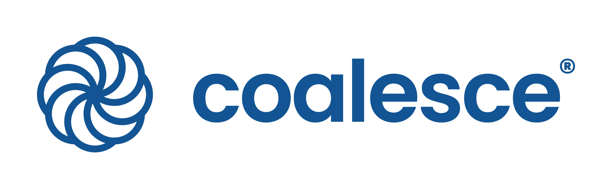

<div align="center">

[](https://coalesce.io&#x2F;)

# [Coalesce](https://coalesce.io&#x2F;)<a id="coalesce"></a>

REST API for performing operations with the Coalesce backend.

</div>

## Table of Contents<a id="table-of-contents"></a>

<!-- toc -->

- [Installation](#installation)
- [Getting Started](#getting-started)
- [Reference](#reference)
  * [`coalesce.environments.getInformation`](#coalesceenvironmentsgetinformation)
  * [`coalesce.environments.listInformation`](#coalesceenvironmentslistinformation)
  * [`coalesce.jobs.cancelJobRun`](#coalescejobscanceljobrun)
  * [`coalesce.jobs.getStatusUpdates`](#coalescejobsgetstatusupdates)
  * [`coalesce.jobs.initiateRun`](#coalescejobsinitiaterun)
  * [`coalesce.jobs.triggerRerun`](#coalescejobstriggerrerun)
  * [`coalesce.nodes.getInformation`](#coalescenodesgetinformation)
  * [`coalesce.nodes.list`](#coalescenodeslist)
  * [`coalesce.runs.getRunDetails`](#coalescerunsgetrundetails)
  * [`coalesce.runs.listInformation`](#coalescerunslistinformation)
  * [`coalesce.runs.listResults`](#coalescerunslistresults)

<!-- tocstop -->

## Installation<a id="installation"></a>
<div align="center">
  <a href="https://konfigthis.com/sdk-sign-up?company=Coalesce&language=TypeScript">
    
  </a>
</div>

## Getting Started<a id="getting-started"></a>

```typescript
import { Coalesce } from "coalesce-typescript-sdk";

const coalesce = new Coalesce({
  // Defining the base path is optional and defaults to https://app.coalescesoftware.io
  // basePath: "https://app.coalescesoftware.io",
  accessToken: "ACCESS_TOKEN",
  apiKey: "API_KEY",
});

const getInformationResponse = await coalesce.environments.getInformation({});

console.log(getInformationResponse);
```

## Reference<a id="reference"></a>


### `coalesce.environments.getInformation`<a id="coalesceenvironmentsgetinformation"></a>

Get information about an environment.

#### 🛠️ Usage<a id="🛠️-usage"></a>

```typescript
const getInformationResponse = await coalesce.environments.getInformation({});
```

#### ⚙️ Parameters<a id="⚙️-parameters"></a>

##### environmentID: `string`<a id="environmentid-string"></a>

The environment ID.

#### 🔄 Return<a id="🔄-return"></a>

[BaseEnvironment](./models/base-environment.ts)

#### 🌐 Endpoint<a id="🌐-endpoint"></a>

`/api/v1/environments/{environmentID}` `GET`

[🔙 **Back to Table of Contents**](#table-of-contents)

---


### `coalesce.environments.listInformation`<a id="coalesceenvironmentslistinformation"></a>

Get a collection of environment information.

#### 🛠️ Usage<a id="🛠️-usage"></a>

```typescript
const listInformationResponse = await coalesce.environments.listInformation({
  detail: false,
});
```

#### ⚙️ Parameters<a id="⚙️-parameters"></a>

##### detail: `boolean`<a id="detail-boolean"></a>

Include the full detail of the environments.

#### 🔄 Return<a id="🔄-return"></a>

[EnvironmentsResponse](./models/environments-response.ts)

#### 🌐 Endpoint<a id="🌐-endpoint"></a>

`/api/v1/environments` `GET`

[🔙 **Back to Table of Contents**](#table-of-contents)

---


### `coalesce.jobs.cancelJobRun`<a id="coalescejobscanceljobrun"></a>

Querying this endpoint will cancel a currently running job.

#### 🛠️ Usage<a id="🛠️-usage"></a>

```typescript
const cancelJobRunResponse = await coalesce.jobs.cancelJobRun({
  runID: 1,
});
```

#### ⚙️ Parameters<a id="⚙️-parameters"></a>

##### runID: `number`<a id="runid-number"></a>

The ID of the run the user would like to cancel.

##### orgID: `string`<a id="orgid-string"></a>

The organization\\\'s ID of the run the user would like to cancel.

##### environmentID: `string`<a id="environmentid-string"></a>

The environment ID of the run the user would like to cancel.

#### 🌐 Endpoint<a id="🌐-endpoint"></a>

`/scheduler/cancelRun` `POST`

[🔙 **Back to Table of Contents**](#table-of-contents)

---


### `coalesce.jobs.getStatusUpdates`<a id="coalescejobsgetstatusupdates"></a>

Querying this endpoint will allow you to receive updates on the current status of a specific run.

#### 🛠️ Usage<a id="🛠️-usage"></a>

```typescript
const getStatusUpdatesResponse = await coalesce.jobs.getStatusUpdates({
  runCounter: 1,
});
```

#### ⚙️ Parameters<a id="⚙️-parameters"></a>

##### runCounter: `number`<a id="runcounter-number"></a>

ID of the run to query

#### 🔄 Return<a id="🔄-return"></a>

[JobsGetStatusUpdatesResponse](./models/jobs-get-status-updates-response.ts)

#### 🌐 Endpoint<a id="🌐-endpoint"></a>

`/scheduler/runStatus` `GET`

[🔙 **Back to Table of Contents**](#table-of-contents)

---


### `coalesce.jobs.initiateRun`<a id="coalescejobsinitiaterun"></a>

Querying this endpoint will initiate a new run to refresh your data warehouse based on your specified details.

#### 🛠️ Usage<a id="🛠️-usage"></a>

```typescript
const initiateRunResponse = await coalesce.jobs.initiateRun({
  runDetails: {
    environmentID: "environmentID_example",
    parallelism: 16,
  },
});
```

#### ⚙️ Parameters<a id="⚙️-parameters"></a>

##### runDetails: [`JobsInitiateRunRequestRunDetails`](./models/jobs-initiate-run-request-run-details.ts)<a id="rundetails-jobsinitiaterunrequestrundetailsmodelsjobs-initiate-run-request-run-detailsts"></a>

##### parameters: `string`<a id="parameters-string"></a>

Contains parameters to be used in the Refresh

##### userCredentials: [`JobsInitiateRunRequestUserCredentials`](./models/jobs-initiate-run-request-user-credentials.ts)<a id="usercredentials-jobsinitiaterunrequestusercredentialsmodelsjobs-initiate-run-request-user-credentialsts"></a>

#### 🔄 Return<a id="🔄-return"></a>

[JobsInitiateRunResponse](./models/jobs-initiate-run-response.ts)

#### 🌐 Endpoint<a id="🌐-endpoint"></a>

`/scheduler/startRun` `POST`

[🔙 **Back to Table of Contents**](#table-of-contents)

---


### `coalesce.jobs.triggerRerun`<a id="coalescejobstriggerrerun"></a>

Querying this endpoint will initiate a new run to refresh your data warehouse based on your specified details.

#### 🛠️ Usage<a id="🛠️-usage"></a>

```typescript
const triggerRerunResponse = await coalesce.jobs.triggerRerun({
  runDetails: {
    runID: "runID_example",
  },
  userCredentials: {
    snowflakeAuthType: "Basic",
  },
});
```

#### ⚙️ Parameters<a id="⚙️-parameters"></a>

##### runDetails: [`JobsTriggerRerunRequestRunDetails`](./models/jobs-trigger-rerun-request-run-details.ts)<a id="rundetails-jobstriggerrerunrequestrundetailsmodelsjobs-trigger-rerun-request-run-detailsts"></a>

##### userCredentials: [`JobsTriggerRerunRequestUserCredentials`](./models/jobs-trigger-rerun-request-user-credentials.ts)<a id="usercredentials-jobstriggerrerunrequestusercredentialsmodelsjobs-trigger-rerun-request-user-credentialsts"></a>

##### parameters: `string`<a id="parameters-string"></a>

Contains parameters to be used in the Refresh

#### 🔄 Return<a id="🔄-return"></a>

[JobsTriggerRerunResponse](./models/jobs-trigger-rerun-response.ts)

#### 🌐 Endpoint<a id="🌐-endpoint"></a>

`/scheduler/rerun` `POST`

[🔙 **Back to Table of Contents**](#table-of-contents)

---


### `coalesce.nodes.getInformation`<a id="coalescenodesgetinformation"></a>

Get information about a node in an environment.

#### 🛠️ Usage<a id="🛠️-usage"></a>

```typescript
const getInformationResponse = await coalesce.nodes.getInformation({});
```

#### ⚙️ Parameters<a id="⚙️-parameters"></a>

##### environmentID: `string`<a id="environmentid-string"></a>

The environment ID.

##### nodeID: `string`<a id="nodeid-string"></a>

The node ID.

#### 🔄 Return<a id="🔄-return"></a>

[Node](./models/node.ts)

#### 🌐 Endpoint<a id="🌐-endpoint"></a>

`/api/v1/environments/{environmentID}/nodes/{nodeID}` `GET`

[🔙 **Back to Table of Contents**](#table-of-contents)

---


### `coalesce.nodes.list`<a id="coalescenodeslist"></a>

Get a collection of nodes for an environment

#### 🛠️ Usage<a id="🛠️-usage"></a>

```typescript
const listResponse = await coalesce.nodes.list({
  detail: false,
});
```

#### ⚙️ Parameters<a id="⚙️-parameters"></a>

##### environmentID: `string`<a id="environmentid-string"></a>

The environment ID.

##### detail: `boolean`<a id="detail-boolean"></a>

Include the full detail of the nodes.

#### 🔄 Return<a id="🔄-return"></a>

[NodesResponse](./models/nodes-response.ts)

#### 🌐 Endpoint<a id="🌐-endpoint"></a>

`/api/v1/environments/{environmentID}/nodes` `GET`

[🔙 **Back to Table of Contents**](#table-of-contents)

---


### `coalesce.runs.getRunDetails`<a id="coalescerunsgetrundetails"></a>

Gets a single run.

#### 🛠️ Usage<a id="🛠️-usage"></a>

```typescript
const getRunDetailsResponse = await coalesce.runs.getRunDetails({
  runID: 1,
});
```

#### ⚙️ Parameters<a id="⚙️-parameters"></a>

##### runID: `number`<a id="runid-number"></a>

The run ID.

#### 🔄 Return<a id="🔄-return"></a>

[RunInfo](./models/run-info.ts)

#### 🌐 Endpoint<a id="🌐-endpoint"></a>

`/api/v1/runs/{runID}` `GET`

[🔙 **Back to Table of Contents**](#table-of-contents)

---


### `coalesce.runs.listInformation`<a id="coalescerunslistinformation"></a>

Get a collection of information about runs.

#### 🛠️ Usage<a id="🛠️-usage"></a>

```typescript
const listInformationResponse = await coalesce.runs.listInformation({
  limit: 25,
  orderBy: "id",
  orderByDirection: "desc",
  runType: "deploy",
  runStatus: "canceled",
  detail: false,
});
```

#### ⚙️ Parameters<a id="⚙️-parameters"></a>

##### limit: `number`<a id="limit-number"></a>

The maximum number of runs to return.

##### startingFrom: [`RunsListInformationStartingFromParameter`](./models/runs-list-information-starting-from-parameter.ts)<a id="startingfrom-runslistinformationstartingfromparametermodelsruns-list-information-starting-from-parameterts"></a>

The starting run ID, runStartTime, or runEndTime (exclusive) for paging the query results.

##### orderBy: [`RunsOrderBy`](./models/runs-order-by.ts)<a id="orderby-runsorderbymodelsruns-order-byts"></a>

The field used to order results.

##### orderByDirection: `'asc' | 'desc'`<a id="orderbydirection-asc--desc"></a>

The sort order for query results.

##### runType: [`RunType`](./models/run-type.ts)<a id="runtype-runtypemodelsrun-typets"></a>

A run type to filter the query results.

##### runStatus: [`RunStatus`](./models/run-status.ts)<a id="runstatus-runstatusmodelsrun-statusts"></a>

A status value to filter the query results.

##### environmentID: `string`<a id="environmentid-string"></a>

An environment ID to filter the query results.

##### detail: `boolean`<a id="detail-boolean"></a>

Include the full detail of the run.

#### 🔄 Return<a id="🔄-return"></a>

[RunsResponse](./models/runs-response.ts)

#### 🌐 Endpoint<a id="🌐-endpoint"></a>

`/api/v1/runs` `GET`

[🔙 **Back to Table of Contents**](#table-of-contents)

---


### `coalesce.runs.listResults`<a id="coalescerunslistresults"></a>

Get a collection of the results of a deploy or refresh run

#### 🛠️ Usage<a id="🛠️-usage"></a>

```typescript
const listResultsResponse = await coalesce.runs.listResults({
  runID: 1,
});
```

#### ⚙️ Parameters<a id="⚙️-parameters"></a>

##### runID: `number`<a id="runid-number"></a>

The run ID.

#### 🔄 Return<a id="🔄-return"></a>

[RunResultsResponse](./models/run-results-response.ts)

#### 🌐 Endpoint<a id="🌐-endpoint"></a>

`/api/v1/runs/{runID}/results` `GET`

[🔙 **Back to Table of Contents**](#table-of-contents)

---


## Author<a id="author"></a>
This TypeScript package is automatically generated by [Konfig](https://konfigthis.com)
